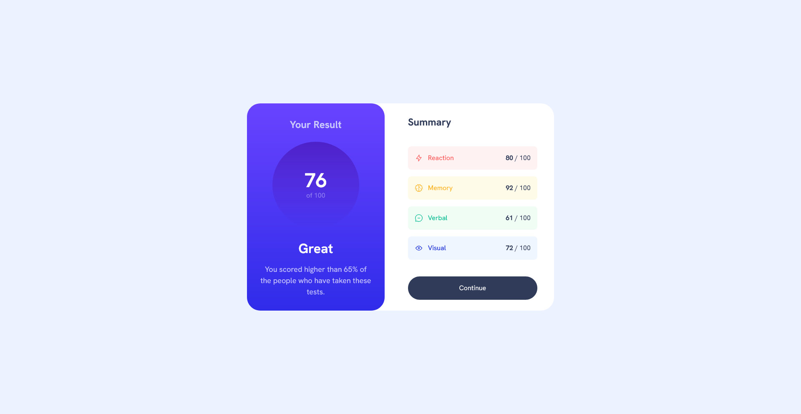
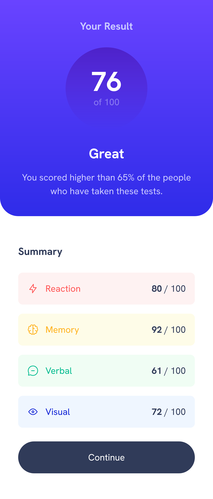

# Frontend Mentor - Results Summary Component

This is a solution to the [Results Summary Component challenge](https://www.frontendmentor.io/challenges/results-summary-component-CE_K6s0maV) on Frontend Mentor. Frontend Mentor challenges help you improve your coding skills by building realistic projects.

## Overview

### The Challenge

Users should be able to:

- View the optimal layout for the interface depending on their device's screen size
- See hover and focus states for all interactive elements on the page

### Screenshot





### Links

- [Solution on Frontend Mentor](https://www.frontendmentor.io/solutions/results-summary-component-using-svelte-and-tailwind-css-XXXXXXXXXXXX)
- [Live Site](https://crtykwod-results-summary-component.vercel.app/)

## My Process

### Built With

- [Svelte](https://svelte.dev/) - JavaScript Framework
- [SvelteKit](https://kit.svelte.dev/) - Framework for building Svelte applications
- [Tailwind CSS](https://tailwindcss.com/) - CSS Framework
- Mobile-first approach
- Reusable components
- TypeScript for static typing

### What I Learned

This project marks my first experience with Svelte and SvelteKit! After working with other frameworks like React, I decided to explore Svelte for its compiled approach and cleaner syntax.

#### Component Structure in Svelte

I learned how to create reusable components in Svelte, which have a much cleaner and more direct syntax compared to other frameworks:

```svelte
<!-- Example of a Svelte component -->
<script lang="ts">
  export let category: string;
  export let score: number;
  export let icon: string;
  export let bgClass: string;
  export let textClass: string;
</script>

<div class={`flex items-center justify-between p-4 rounded-lg ${bgClass}`}>
  <div class="flex items-center">
    
    <span class={textClass}>{category}</span>
  </div>
  <div>
    <span class="font-bold">{score}</span>
    <span class="text-gray-400"> / 100</span>
  </div>
</div>
```

#### Data Management

I learned how to import and manipulate JSON data directly in Svelte:

```svelte
<script lang="ts">
  import resultsData from "$lib/data/data.json";
  
  // Data transformation with map and spread operator
  const categories = resultsData.map(item => ({
    ...item,
    textClass: STYLES_BY_CATEGORY[item.category]?.textClass || "text-gray-500",
    bgClass: STYLES_BY_CATEGORY[item.category]?.bgClass || "bg-gray-50",
  }));
</script>
```

#### File Organization in SvelteKit

I discovered how SvelteKit organizes files and how this makes development easier:

- `src/routes` for pages
- `src/lib/components` for reusable components
- `src/lib/data` for data files
- `static` for static files like images

#### Integration with Tailwind CSS

I learned how to configure and use Tailwind CSS with Svelte, which made styling much faster and more consistent:

```svelte
<div class="md:bg-very-light-blue md:flex md:items-center min-h-svh">
  <div class="bg-white flex flex-col gap-4 justify-center items-center m-auto md:flex-row md:rounded-4xl sm:w-[min(80%,46rem)]">
    <!-- Content -->
  </div>
</div>
```

#### Spread Props in Svelte

I discovered how to pass all properties of an object to a component using the spread operator:

<ResultCard {...result}/>

### Challenges Overcome

1. **Understanding SvelteKit's Structure**: Initially, it was challenging to understand where to place each file (components, data, images), but SvelteKit's logical structure soon made sense.

2. **Arrow Function Syntax with Objects**: I learned that when returning an object literal directly in an arrow function, it's necessary to wrap it in parentheses:

```javascript
  const categories = resultsData.map(item => ({
    ...item,
    textClass: STYLES_BY_CATEGORY[item.category]?.textClass
  }));
```

3. **TypeScript Typing**: Implementing proper typing for components and data was an interesting challenge, especially when working with dynamic objects.

4. **Responsiveness with Tailwind**: Creating a layout that works well on both mobile and desktop devices required a good understanding of Tailwind's responsive classes.

### Continued Development

For future projects with Svelte, I plan to:

- Explore more of Svelte's native reactivity
- Learn about Svelte stores for state management
- Deepen my knowledge of animations in Svelte
- Explore advanced SvelteKit features like SSR (Server-Side Rendering) and API endpoints
- Learn about Storybook and how to use it with Svelte

### Useful Resources

- [Svelte Documentation](https://svelte.dev/docs) - The official Svelte documentation is excellent for beginners.
- [SvelteKit Documentation](https://kit.svelte.dev/docs) - Comprehensive guide on the SvelteKit framework.
- [Tailwind CSS Docs](https://tailwindcss.com/docs) - Indispensable reference for Tailwind classes.
- [Learn Svelte](https://learn.svelte.dev/) - Interactive tutorial that helps understand the basic concepts of Svelte.

## Author

- GitHub - [Carlos Samuel](https://github.com/Crtykwod) -
- Frontend Mentor - [@Crtykwod](https://www.frontendmentor.io/profile/Crtykwod)